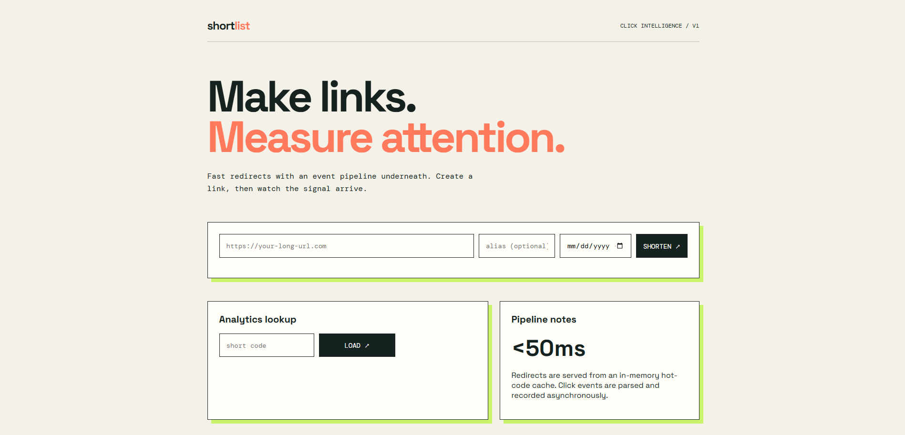

# ShortUrl/Link

ShortLink is a Java Spring Boot-based URL shortening application that converts long URLs into short, shareable links and tracks link performance. It supports custom aliases, expiration, deactivation, and analytics for monitoring clicks.

## Features

- Create short URLs from long URLs
- Support custom short aliases
- Expiration support for links
- Deactivate inactive or unsafe links
- Redirect short links to their original URLs
- Track click analytics such as:
  - total clicks
  - unique visitors
  - country-wise traffic
  - referrer statistics
  - browser and device detection
  - daily click trends
- In-memory caching for faster lookup of active links
- Asynchronous click logging for improved performance

## Image of the website

## Tech Stack

- Java 25
- Spring Boot 4.1.0
- Spring Web MVC
- Spring Data JPA
- PostgreSQL
- Maven

## Project Structure

- `src/main/java/com/pratik/demourl` - Application source code
- `src/main/resources` - Application configuration and static assets
- `src/test/java` - Test classes

## Core Components

- `ShortUrlController` - Handles HTTP endpoints for creating, redirecting, and managing links
- `ShortUrlService` - Contains business logic for URL validation, code generation, analytics, and tracking
- `LinkRecord` - Stores the original URL, generated short code, expiry date, and active status
- `ClickEvent` - Records click metadata such as IP, country, browser, device, and referrer
- `LinkRecordRepository` / `ClickEventRepository` - Database access layers

## API Endpoints

### Create Short URL
- `POST /api/urls`
- Request body:
  - `url` - long URL
  - `alias` - optional custom alias
  - `expiresAt` - optional expiration timestamp

### Redirect
- `GET /{code}`
- Redirects to the original URL if valid and active

### Analytics
- `GET /api/urls/{code}/analytics`
- Returns click history and top metrics

### Deactivate Link
- `DELETE /api/urls/{code}`

## Example Flow

1. User submits a long URL
2. Application validates the URL and generates a unique short code
3. Short link is stored in PostgreSQL
4. Redirect endpoint resolves the short code to the original URL
5. Click details are stored asynchronously for analytics

## Database Design

The application stores:
- generated short codes
- original destination URLs
- active/inactive status
- expiration timestamps
- click event records for analytics

## Performance Considerations

The project demonstrates several practical backend optimization ideas:

- in-memory cache for frequently accessed links
- asynchronous click event processing
- validation before saving records
- efficient aggregation for analytics queries
- use of PostgreSQL for reliable and scalable persistence

## Setup and Run

### Prerequisites

- Java 25+
- Maven
- PostgreSQL database

### Configuration

Update database configuration in `src/main/resources/application.properties` with your PostgreSQL credentials.

## Future Improvements

- Add user authentication and dashboard
- Add rate limiting and abuse prevention
- Add QR code generation for links
- Add admin panel for managing all short links
- Support analytics with charts and visual dashboards
- Add caching with Redis for better scalability

## License

This project is for educational and portfolio use.